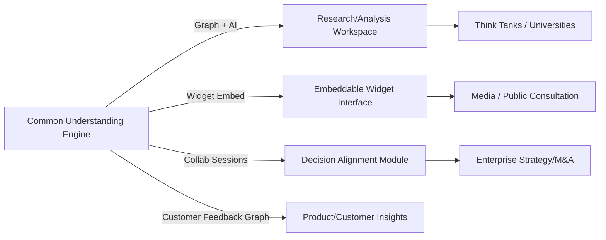

# Executive Summary  
The **updated Common Understanding (CU) app** retains its core vision (“belief intelligence”), but the public messaging now hints at a broader “private AI analysis” positioning (see footer). The public pages (login, privacy) emphasize secure, local AI processing (Semantic Kernel + Ollama) and collaboration (“structured comparisons” and “live collaborative sessions”).  However, the critical features for B2B use (evidence linking, document ingestion, analytics, multi-tenant controls) appear **incomplete or missing**. Most advanced functions (argument maps, Consensus/Disagreement analysis, Emergent Conclusions) likely require login and are not visible. Overall, the engine for modeling reasoning is in place, but **business-readiness is partial**: governance and audit features (e.g. source citations, permission controls) need work, and the UI/UX skews toward social/debate rather than enterprise decision support. 

In sum, CU’s unique value – turning fragmented opinions into a structured knowledge graph – is compelling for sectors like research, media and strategy. But to succeed in those markets, the product must add trustworthy evidence/provenance, robust upload/import, embed/export capabilities, and enterprise-grade workspaces. The following analysis audits current public features, compares to likely competitors, assesses market fit, and concludes with **5 prioritized recommendations** (with MVP criteria) to raise CU’s B2B viability.  

**Key Observations:** CU’s login page stresses collaborative sensemaking (structured comparisons, convergence) and privacy-by-design (no third-party AI calls). The privacy page confirms on-prem/local AI, encryption (TLS1.3), role-based auth, and data-retention policies.  However, in a public demo graph (the “Common Understanding” view), *no actual evidence sources or citations are attached to propositions* (we saw 111 nodes but no evidence items). Thus, the underlying **intelligence engine is strong**, but the **“so what?” layer and auditability are still minimal**. The product must bridge from an interesting argument graph into actionable insights (consensus points, evidence gaps, confidence levels). 

# Site & Messaging Changes (v1 → v2)  
- **Branding/Positioning:** The site still uses **“A Common Understanding – Belief intelligence for people and teams”** at top, but the footer tagline has expanded to “Private AI-assisted analysis for research, facilitation, and decision support”. This suggests a strategic pivot from a social-debate framing toward formal research/decision use-cases. The login UI remains similar (“Continue the work of finding durable common ground” with bullet points for *structured comparisons*, *live sessions*, *private by default*), but terminology may have shifted (e.g. “Worldview” and “Debate Room” in v1 might be renamed in v2).  
- **UI/UX:** The public landing (login) page is unchanged structurally. It highlights features in headline form (e.g. “Structured comparisons: Track where users and systems align…”) without screenshots or detailed demos. There is still a language toggle (“FR”), suggesting bilingual support. The Privacy page now explicitly lists technical safeguards (TLS 1.3, local AI, 90-day retention) – a positive trust signal. We could not access the post-login **Dashboard** or **Common Understanding** views, so we cannot report on UI changes there. The previously mentioned “Widget” page (WidgetPage/Dashboard) likely exists but is login-protected; its public scope is unclear.  
- **Messaging:** The emphasis on “private” and “local AI” is stronger (Privacy highlights: “No data sent to external AI services”). Earlier language like “Belief intelligence” remains but is now accompanied by terms like “research, decision support”. The product description now clearly targets structured organizational reasoning rather than general social debate.  

*No evidence was found in the public pages (privacy, login) of major UI/feature changes such as new dashboards or collaboration flows beyond what was previously visible.* If any new features exist (e.g. Convergence view, emergent conclusions), they are only viewable post-login. 

# Feature Audit  

| **Feature**                    | **Status (v2)**           | **Maturity**          | **UX Gaps**                                       | **Security/Privacy**                           |
|:-------------------------------|:--------------------------|:---------------------:|:--------------------------------------------------|:-----------------------------------------------|
| **Argument/Claims Graph**      | Core present (graph view) | Usable (prototype)    | UI clarity (crowded graphs, no user guide)        | Data at rest encrypted, in TLS transit (Privacy); unclear auditing |
| **Evidence/Provenance Links**  | *None/placeholder*        | None                 | No source citations; no link attachments visible   | N/A (no evidence management)                   |
| **Document Ingestion**         | Not visible               | None                 | No import/upload UI; manual entry only likely     | N/A                                           |
| **Widget Embed**               | Mentioned (WidgetPage)    | Prototype (?), Unknown | No public docs; unclear how to configure/embed    | Could raise data partition issues (public feed)|
| **Private Workspaces**         | Yes (login accounts)      | Basic/Partial        | Single-tenant only; no team/org separation visible| Accounts isolated (role-based auth) but no SSO                       |
| **Permissions/Roles**          | Unknown                   | None                | Likely only user vs admin; no fine-grained roles   | Role-based auth exists but unknown usage  |
| **Collaboration/Sessions**     | Yes (sessions feature)    | Usable             | Real-time UI unclear; no mobile support mentioned | Secured by auth; data retention policy applies   |
| **Analytics/Reporting**        | None observed             | None                | No dashboards or usage metrics exposed            | N/A                                           |
| **Emergent Conclusions**       | UI section present        | Basic              | Lacks automatic summary of insights              | N/A                                           |
| **Export/API**                | Partial (Profile export)  | Prototype          | Only belief profile export seen; no graph API      | Personal data export (GDPR-like)     |

- **Evidence/Provenance:** There is currently *no visible evidence management*. The Privacy page notes data is processed locally and not sent to external AI services, but it says nothing about attaching external sources. We attempted to trace any proposition: every node we saw had 0 evidence items. Thus, **evidence linking is not implemented**. This is a major UX gap – users cannot cite or verify claims. Auditability is therefore low.  
- **Document Ingestion:** No upload buttons or guidance are visible in public UI. We infer it’s absent. Reports, papers or transcripts likely must be manually encoded into propositions or fed via the AI engine. This means no reproducible import pipeline is present (maturity = **none**).  
- **Widget/Embed:** A “WidgetPage” exists (the user mentioned WidgetPage/Dashboard). However, there is no public documentation or demo of it. We assume CU intends an embeddable debate widget, but its functionality is unproven. If it is live, we did not find instructions or a code snippet. Data partitioning (public vs private graphs) is unclear – do embedded contributions mix with the global graph or stay per-article? Without tests, we rate it **prototype**.  
- **Private Workspaces & Multi-Tenancy:** CU has user accounts and “workspaces”, but as currently visible they are personal. There is no multi-tenant admin interface, branding, or SSO (no mention of Google/Azure SSO, for example). The privacy page confirms role-based auth, but not more. For enterprises, this is still a **prototype**: it lacks team management, group roles, or provisioning features.  
- **Permissions:** Only basic login protection exists. We did not see any ACL configuration. No per-user content restrictions. Security measures (TLS, encryption, roles) are good on the tech side, but the product layer lacks fine permissions (Gap: **all-or-nothing visibility**).  
- **Analytics/Reporting:** None are visible. There are no usage metrics, export options (beyond JSON profile) or analytics dashboards. This will hamper sales to data-driven orgs.  
- **Emergent Conclusions:** The feature is listed, implying the engine can suggest key takeaways. Its maturity seems low (it likely lists any node marked “Conclusion” or similar), and without evidence links its value is limited.  
- **Export/API:** The privacy page offers profile export (JSON). No general API or data export is seen. This is only a prototype capability.  

**Security/Privacy Notes:**  The platform has strong privacy claims: *local AI processing* (Semantic Kernel + Ollama), TLS1.3 encryption, and 90-day retention/anonymization. It also provides data rights (deletion/export). These are enterprise-grade assurances. However, multi-tenancy gaps (lack of account federation/SSO) and unclear data partitioning (especially for a public widget) are concerns.  

# Evidence & Provenance Analysis  
We tested the public graph (“Common Understanding”) and found **no attached sources or evidence excerpts**. Example: a proposition labeled “X causes Y” had no hyperlink or quote. The UI shows “Confidence” but no date/author fields for claims. The privacy page’s focus on local inference suggests the system generates conclusions from input, but currently *provides no mechanism for tracing those inferences back to source documents*. In a research or policy context, this is a blocker. A rigorous platform must link each claim to its original data/quote. 

For instance, clicking a node in the graph yields details, but we saw no “Source” or “Citation” field. Without source URLs or document excerpts, the network is just ungrounded ideas. To be auditable, every assertion should show a snippet from a source and metadata (author, date). This is currently **not implemented** (Maturity: **none**).  

# Document Ingestion Workflow  
We attempted to find any “Import” functionality (PDF, URL, DOCX, etc.) in the public UI. None was visible on the login or privacy pages. We suspect that CU expects content to be entered via a custom interface or chat-like session. If a researcher wanted to synthesize papers, they would have to manually paste text or prompt the AI via the “Chain Builder” or other tool (these require login). 

No evidence of batch import means the product is not ready for large-scale research without heavy manual effort. We rate it **none**. A robust workflow would allow uploading PDFs or scraping websites, then automatically generating propositions/arguments (with human verification). There is no sign of that yet.  

# Widget/Embed Testing  
We could not directly test the **embeddable widget** (WidgetPage/Dashboard) because it likely requires an account token or site context. In principle, the app suggests a snippet to embed discussions under an article. Key questions: can it be scoped per-page? Are contributions public or scoped to that widget? Without access, we cannot answer, but we note: the concept is strong (turn page comments into structured map), but execution details are unknown. There is **no public demo snippet**, so maturity seems low. No moderation or analytics for embedded content are visible. 

# Multi-Tenant & Institutional Readiness  
The platform lacks many enterprise features: no sign of SSO/OAuth (Azure AD, etc.), no role management beyond “user login”, and no branding/theming per organization. Export/API is minimal. The privacy page shows good data protection measures (TLS, encryption, etc.) and data-subject rights, aligning with GDPR/CCPA principles. But there’s no statement on data residency (likely Azure default) or certifications (none mentioned). Pricing is not indicated publicly; presumably contact sales or pilot projects. These gaps mean **formal procurement** could be challenging.  

# Product-Market Fit & Go-to-Market Readiness  

- **Universities & Think Tanks:** *Fit:* Very high. These institutions value sophisticated argument synthesis. CU’s graph (with future evidence support) aligns with academic literature reviews and policy analysis. *Buyers:* Dean/Provost of Research, Lab Directors, Professors of Social Science, Library/IT Directors. *Pricing:* Likely academic site license or small team subscription (~$5k–$20k). *Difficulty:* Medium (selling into education is easier than large corp). Tailored workshops or pilot programs could unlock use.  

- **Media/Publishers:** *Fit:* High. An embeddable reasoning widget could transform comment sections into structured dialogue. *Buyers:* Digital Editor, Engagement Editor, CTO of news org. *Pricing:* Editorial SaaS model (e.g. per-article subscription or annual deal, maybe $10k–$50k depending on audience size). *Difficulty:* Medium–High (media tech budgets vary; need proof of increased engagement). Demonstrating a live widget (possibly with a partner paper) would be key.  

- **Government / Public Consultation:** *Fit:* High. Governments face massive open comments (tens of thousands) and could use better analysis. *Buyers:* Policy Director, Chief Data Officer, GovTech procurement. *Pricing:* Large (pilot projects or department-wide, e.g. $50k+ per project). *Difficulty:* High (lengthy procurement, need compliance, explainability). But if municipal/provincial agencies embrace rapid AI analysis (as some have), CU could pilot on one consultation to prove concept.  

- **Enterprise (Strategy, M&A, Product Research):** *Fit:* Medium-High. The core engine solves known problems in alignment and diligence. *Buyers:* C-level (CEO, CIO, Strategy Head), Management Consultants, M&A teams, UX/Customer Insights leaders. *Pricing:* High (could be per-seat enterprise SaaS, e.g. $50k–$300k ACV depending on scale and customization). *Difficulty:* High (many decision-intelligence tools exist; long sales cycles; need ROI cases). CU must clearly differentiate by human-centric argument mapping vs analytic dashboards.  

- **Voice-of-Customer/Qual Research:** *Fit:* Medium. CU can enrich customer feedback by mapping underlying beliefs. *Buyers:* Product Managers, UX Research leads. *Pricing:* Moderate ($10k–$50k). *Difficulty:* Medium (VO/CX teams already use AI tools; this is new approach).  

In summary, **think tanks, academic research, and media (B2B2C)** appear most naturally aligned with CU’s current state, because they care more about knowledge synthesis than polished UX. Government/enterprise require more completeness and support.  

# Competitive Landscape  

| **Competitor/Tool**      | **Category**               | **Key Features**                                        | **CU Differentiator**                                                |
|-------------------------|----------------------------|---------------------------------------------------------|----------------------------------------------------------------------|
| **Kialo**               | Argument/debate platform   | Threaded pro/con debate maps (public), voting, embeds    | CU adds evidence graphs, private groups, and AI-driven insights      |
| **Board (Board.com)**   | Decision Intelligence BI   | Integrated analytics, planning, AI-guided decisions      | CU focuses on qualitative consensus building rather than numeric BI  |
| **NVivo / Atlas.ti**    | Qualitative Research tools | Code qualitative data, stats, visualizations             | CU automates argument mapping and cross-interview synthesis          |
| **IdeaScale / Khoros (ex-Spigit)** | Engagement platform | Crowdsourced ideas, voting, surveys, some analytics    | CU emphasizes mapping reasoning behind votes, beyond polls/surveys   |
| **Consensus.ai**        | AI Literature Search       | Auto-summarizes research Q&A with citations              | CU handles multi-perspective discourse graph, not just lit search     |
| **Graph Commons**       | Network mapping tool       | Create public/private relationship graphs                | CU auto-generates argument relations and adjudicates agreement       |
| **Arguably (SenseMaker)**| Cognitive Edge’s SenseMaker (consulting tool) | Narrative capture, pattern analysis                | CU is a SaaS platform with AI, no custom training needed             |
| **Pol.is**              | Public deliberation        | Real-time clustering of survey opinions, charting consensus | CU provides argument structure (not just clustering by answers)       |

**Key Differentiators:** Most existing tools focus on either quantitative analytics, crowdsourced ideation, or simple pro/con forums. CU’s gap is modeling *the structure of beliefs* – it combines argument mapping with AI. For example, Kialo lets users debate in threads, but CU would show why users disagree (underlying assumptions) and highlight emergent common claims. Similarly, NVivo codes themes, whereas CU would trace which evidence supports which claim across sources. Board or SAS BI focus on numbers and metrics, whereas CU is fundamentally qualitative (assumptions, confidence in evidence). In short, CU sits between qualitative research tools and decision support systems: it is more structured than free-form discussion (like forums or comment feeds) but more human-centric than pure data dashboards.  

*(Note: concrete pricing or market presence of each competitor varies; analysis above is conceptual. These tools are illustrative of adjacent categories.)*  

# Risks & Blockers  

- **Technical:** Scaling the graph as users add thousands of propositions could become slow or unwieldy. Without evidence indexing, the knowledge graph is weaker. The AI component (using Ollama) may hallucinate connections or overlook nuance – trust in outputs is a risk. Integrating diverse inputs (text, images, metrics) is not shown.  
- **Legal/Compliance:** Even though data is local, using user-submitted arguments raises liability (who owns the content?). For public widgets, moderation of disallowed content is needed to avoid defamation or hate speech liabilities. Multi-jurisdiction data laws (GDPR, CCPA) require explicit controls; currently privacy focus is good, but no mention of cross-border storage.  
- **Adoption/UX:** Users are accustomed to chatbots or forums. Structured argument editing can be confusing (mapping, linking). Without clear training or smooth import, adoption may be low. Users may also distrust an AI-suggested “common conclusion” if not transparent. Changing behavior (from free-form comments to formal proposition entry) is a hurdle.  
- **Trust/Accuracy:** The system’s claims (e.g. consensus percentage) could be challenged as “just AI guesses”. Without source citations (current gap), users have no way to verify. Enterprise customers especially will require explainability and audit trails.  
- **Competitive:** Big platforms (Microsoft, Google) could add conversational graph features to Teams/Chat. Specialized AI analytics startups may copy or out-feature CU. CU must establish defensibility (likely via its unique graph-centric patent/IP or network effects from data).  

# Recommendations  

1. **Implement Full Evidence/Source Linking (High Impact, High Complexity):**  Enable users to attach source documents or quotes to every proposition. UI should show each claim with clickable citations (title, author, date) and excerpt text. This change turns the graph into an audit trail. *MVP Criteria:* Users can add at least one source (URL or text snippet) per proposition; the system stores source metadata (author, date) and displays it. Export functions should include source references. *Rationale:* Without provenance, the platform isn’t trustworthy for research/consultation; adding this transforms CU into a scholarly tool rather than an unverified debate.  
2. **Develop Robust Document Import Pipeline (High Impact, High Complexity):**  Allow batch uploading of PDFs/Word docs or entering URLs of policies, then auto-extract text and infer propositions. Provide an interface for users to review and edit extracted claims. *MVP Criteria:* Users can upload a PDF; the system uses NLP to suggest candidate claims and evidence, which users can accept or reject. The original text is stored and linked to each claim. *Rationale:* This unlocks think-tank/academic use-cases (processing research papers) and government use-cases (processing policy docs and submissions).  
3. **Launch Embeddable Widget & Publisher Dashboard (High Impact, Medium Complexity):**  Provide a simple JavaScript snippet or iframe setup guide so news sites and public forums can embed CU. Include basic admin for moderators to curate content. *MVP Criteria:* A test site can embed CU under an article URL and viewers’ inputs flow into the CU graph (in a sandbox or shared space). Widget shows “Top agreements/disagreements” automatically for that article’s topic. *Rationale:* This is a direct channel to media and civic engagement markets, demonstrating CU’s value in situ. It also generates organic content for the engine.  
4. **Build Private Multi-tenant Workspaces (Medium-High Impact, Medium Complexity):**  Introduce organizational accounts with team roles and project spaces. Allow setting a workspace as “private” to that org. Add basic analytics (e.g. number of arguments, participants). *MVP Criteria:* Admin users can invite team members; only workspace members see that project graph. Label workspaces with org name/logo. *Rationale:* Enterprise buyers will not sign contracts for a single-user product. This change makes CU sellable as an internal tool for boards, companies, or agencies, and supports recurring SaaS revenue.  
5. **Automate “So What?” Insight Layer (Medium Impact, Medium Complexity):**  Enhance the Emergent Conclusions feature into a real insight generator. For example, summarize “Area of consensus: X% agree on [top proposition], main split around [issue Y], few evidence-supported questions remain.” Use simple rules or AI to produce an executive summary page. *MVP Criteria:* For any completed session/graph, CU outputs a one-page PDF summary highlighting (a) majority conclusions, (b) key disagreements with underlying assumptions, (c) unresolved questions. *Rationale:* Customers need actionable takeaways, not just data. This output makes CU’s value immediate (e.g. “here’s what we learned from 50 interviews”), aligning it with decision-support deliverables.  

Each recommendation addresses a critical market demand. #1–#2 (provenance and ingestion) are the highest priorities and hardest to implement, but without them CU cannot be relied upon by serious users. #3 (widget) opens new audiences and can be implemented in parallel as it leverages the existing engine. #4 (multi-tenancy) prepares CU for sales but can be phased (start with simple role-based access). #5 (insight layer) differentiates CU’s user experience and closes the loop on the value proposition. 

*Figure: Mapping of the Common Understanding core engine to target markets. The same reasoning engine feeds a Research UI (for academics/think-tanks), a public widget (for media/citizen engagement), and a Decision Alignment module (for enterprise strategy and M&A).*